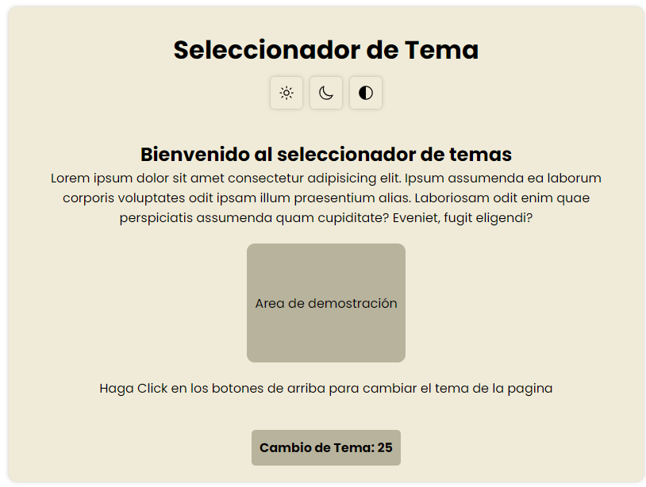
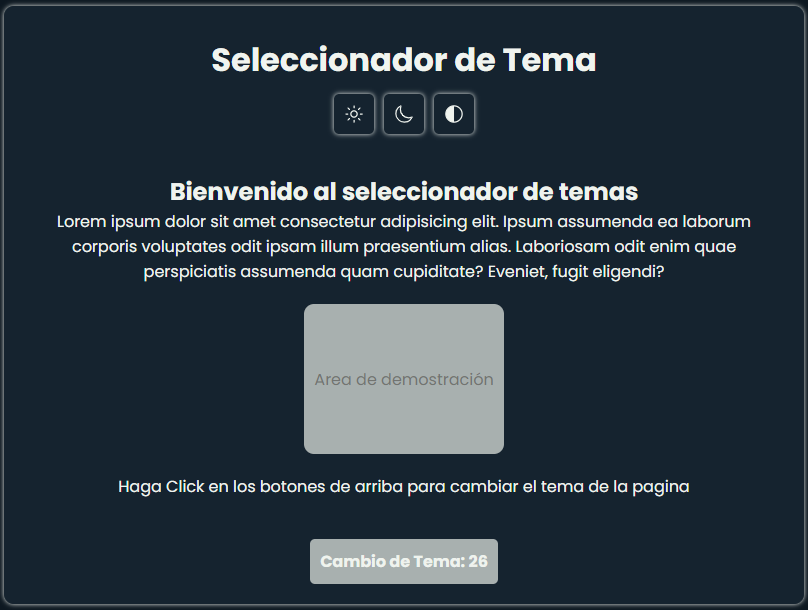
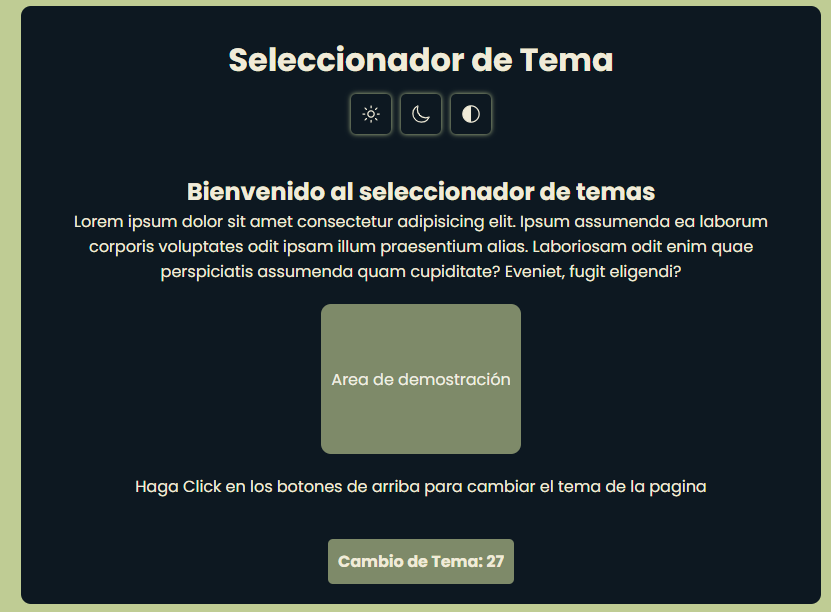

# 🎨 Seleccionador de Tema
## Hecho por: **Adrian Felipe Vargas Rivera**
Este proyecto es una pequeña aplicación web que permite al usuario cambiar el tema visual de la página entre tres estilos: **claro**, **oscuro** y **contraste**. El diseño utiliza **HTML**, **CSS** moderno (con variables y transiciones), **JavaScript** para la lógica del cambio de tema, y **localStorage** para recordar la última selección del usuario.

---

## 📸 Capturas de Pantalla

| Tema Claro | Tema Oscuro | Tema Contraste |
|------------|-------------|----------------|
|  |  |  |

---

## 🚀 Características

✅ Cambio dinámico de tema con botones interactivos  
✅ Uso de `localStorage` para guardar el tema preferido  
✅ Contador de cambios de tema  
✅ Iconos modernos con **IonIcons**  
✅ Estilos separados con variables CSS para facilitar la personalización  
✅ Interfaz simple y amigable

---

## 🧠 ¿Cómo funciona?

### 📁 Estructura del proyecto

```

📁 / (raíz del proyecto)
│
├── index.html         → Estructura principal del sitio
├── styles.css         → Estilos y temas (claro, oscuro, contraste)
├── app.js             → Lógica JavaScript para cambios de tema
├── /images            → Capturas de pantalla

````

---

## 🧱 Código explicado

### 1. 🌐 HTML (`index.html`)

Este archivo contiene la estructura de la interfaz. Incluye los botones para cambiar el tema, el área de demostración visual y un contador que muestra cuántas veces se ha cambiado el tema.

```html
<div class="tema-boton">
  <button id="tema-claro">
    <ion-icon name="sunny-outline"></ion-icon>
  </button>
  <button id="tema-oscuro">
    <ion-icon name="moon-outline"></ion-icon>
  </button>
  <button id="tema-contraste">
    <ion-icon name="contrast-outline"></ion-icon>
  </button>
</div>
````

> 📌 Cada botón tiene un `id` único que se usa para aplicar el tema correspondiente con JavaScript.

También hay un contador:

```html
<div class="contador">
  <span>Cambio de Tema:</span>
  <span id="contador">0</span>
</div>
```

---

### 2. 🎨 CSS (`styles.css`)

Se utilizan variables CSS para definir colores principales:

```css
:root {
  --main-color: #f0ebd8;
  --dark-color: #0d1821;
  --contrast-color: #bfcc94;
  ...
}
```

Luego, se aplican clases diferentes al `<body>` dependiendo del tema seleccionado:

```css
.tema-claro { ... }
.tema-oscuro { ... }
.tema-contraste { ... }
```

Esto permite tener una estructura limpia y centralizar los estilos de cada tema.

---

### 3. ⚙️ JavaScript (`app.js`)

Este archivo maneja:

* El cambio dinámico de tema
* Guardar el tema en `localStorage`
* Actualizar el contador cada vez que se hace un cambio

#### Guardar tema seleccionado

```javascript
function guardarTema(tema) {
  localStorage.setItem("temaSeleccionado", tema);
}
```

#### Cargar tema al iniciar

```javascript
function cargarTemaGuardado() {
  const temaGuardado = localStorage.getItem("temaSeleccionado");
  if (temaGuardado) {
    eliminarClasesDeTema();
    body.classList.add(temaGuardado);
  }
}
```

#### Lógica del cambio de tema

```javascript
botonClaro.addEventListener("click", () => {
  eliminarClasesDeTema();
  body.classList.add("tema-claro");
  guardarTema("tema-claro");
  actualizarContador();
});
```

#### Contador

```javascript
let contador = 0;

function actualizarContador() {
  contador++;
  contadorElemento.textContent = contador;
}
```

> 🎯 Este contador no se guarda en `localStorage`, por lo tanto se reinicia al recargar la página.

---

## 📦 Tecnologías utilizadas

* **HTML5**
* **CSS3** con variables y transiciones
* **JavaScript (ES6)**
* **Google Fonts** (Poppins)
* **IonIcons** para los iconos

---

## 📋 Mejoras posibles

* [ ] Guardar el contador en `localStorage` para mantenerlo entre sesiones
* [ ] Animaciones más fluidas al cambiar tema
* [ ] Agregar más temas personalizables
* [ ] Implementar selector automático de tema según la hora del día

---

## ✅ Cómo usar

1. Clona el repositorio o descarga los archivos:

   ```bash
   git clone https://github.com/tu-usuario/selector-tema.git
   cd selector-tema
   ```

2. Abre el archivo `index.html` en tu navegador.

3. Haz clic en los iconos para cambiar el tema. El cambio se reflejará en toda la página, y tu elección será recordada la próxima vez que abras el sitio.

---

## 🙌 Créditos

Proyecto desarrollado con fines educativos.
Iconos proporcionados por [IonIcons](https://ionic.io/ionicons)
Fuente: [Poppins - Google Fonts](https://fonts.google.com/specimen/Poppins)

---


